# prelimactivitynumber2-donotincludeanycode-fionapangilinan
prelimactivitynumber2-donotincludeanycode-fionapangilinan created by GitHub Classroom

May 31, 2016:

main menu

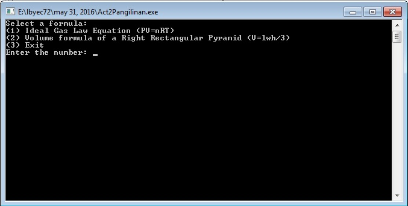
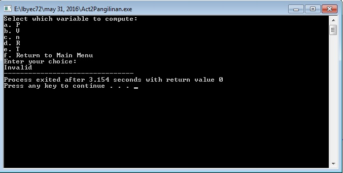
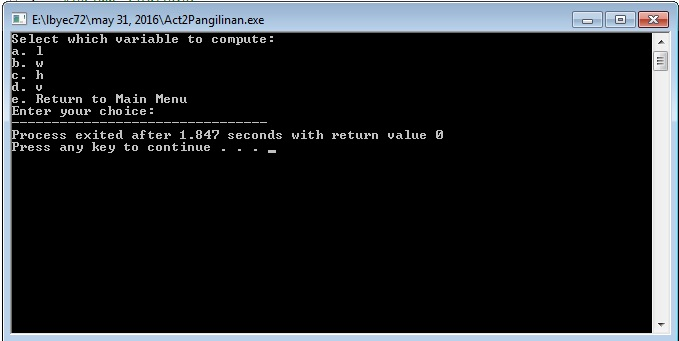
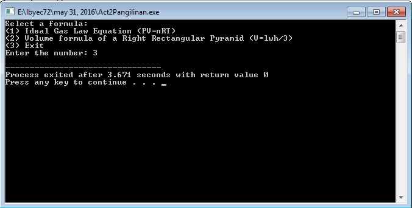

Updated June 7, 2016
Main Menu

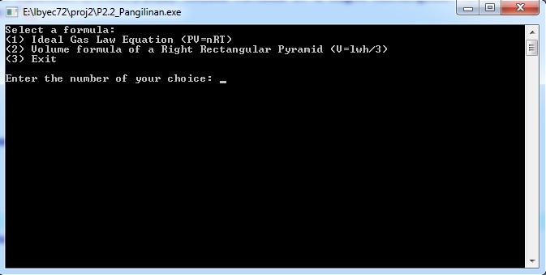

Formula 1

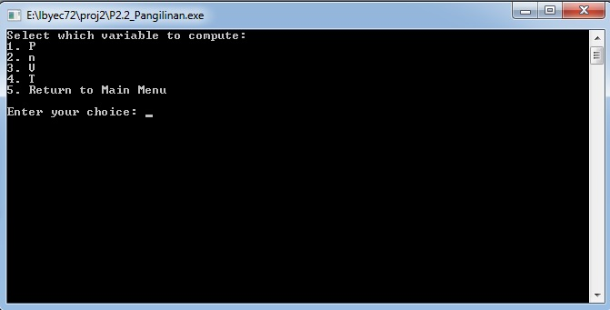

Compute for Pressure

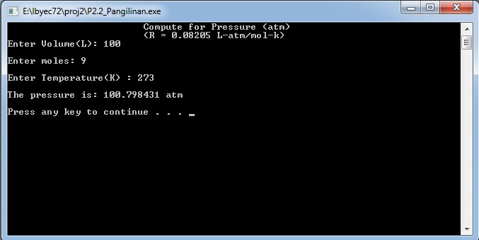

Compute for moles

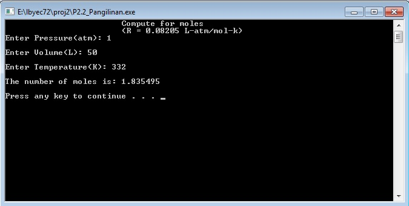

Compute for Volume

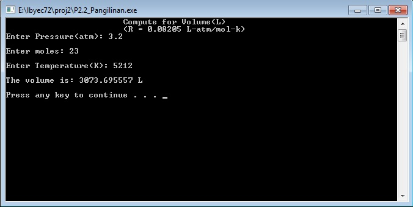

Compute for Temperature

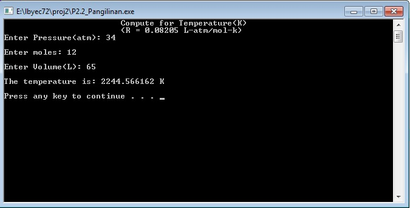

---goes back to formula selection screen then selects choice 2---

Formula 2

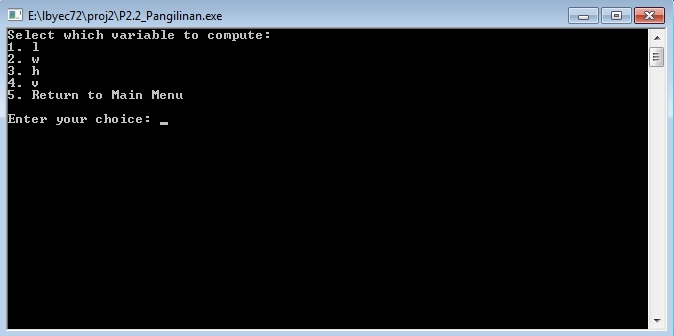

Compute for length

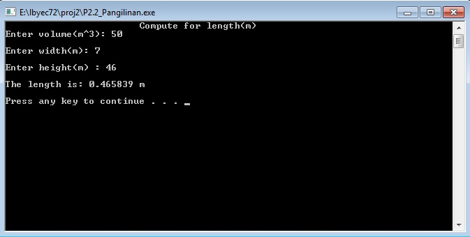

Compute for width

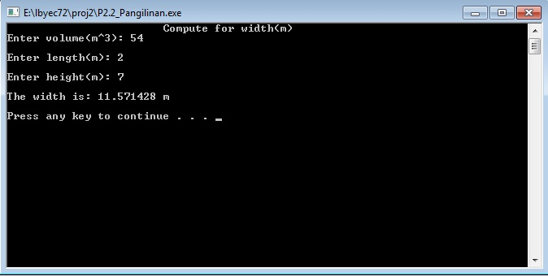

Compute for height

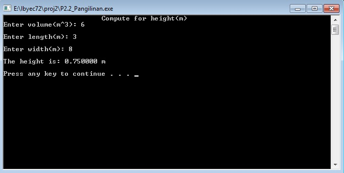

Compute for volume

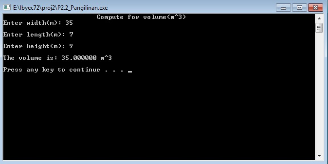

---goes back to formula selection screen---

Chocie 3 = Exit

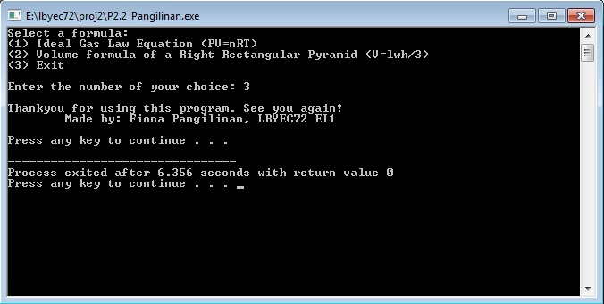
